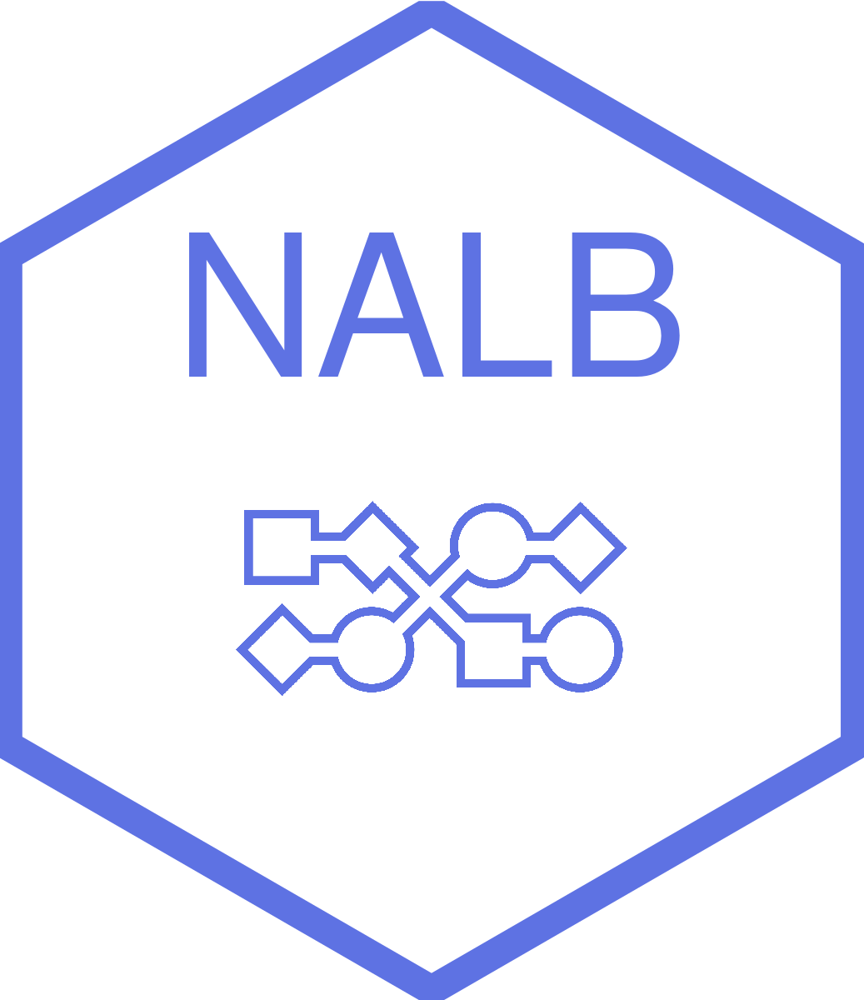

<!-- README.md is generated from README.Rmd. Please edit that file -->

```{r, include = FALSE}
knitr::opts_chunk$set(
  collapse = TRUE,
  comment = "#>",
  fig.path = "man/figures/README-",
  out.width = "100%"
)
```

# NALB <a href=#></a>

## No AutoML Left Behind

The `NALB` package has been designed to provide an R interface to Python autoML libraries. `NALB` runs on top of the `reticulate` package making a "bridge" between Python and R.

A `Dockerfile` was provided to use autoML libraries in production. 

## System requirements

The package was only tested on linux systems and optimized for Ubuntu 20.4 / Debian 10.

## AutoML libraries

<a href=#></a>
<a href=#></a>
<a href=#></a>
<a href=#></a>


## Installation

You can install the development version of NALB using:

``` r
devtools::install_github("geneseng/NALB")
```

## Maintainer

If you got any problems, please contact `yahiaoui-martinez.alex@geneseng.com`.
